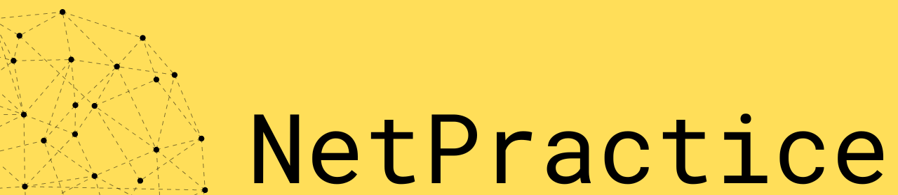

# NetPractice

## Learning Sources :

---

[Network Fundamentals - NetworkChuck](https://www.youtube.com/playlist?list=PLIhvC56v63IJVXv0GJcl9vO5Z6znCVb1P)
[Subneting Mastery - Practical Networking](https://www.youtube.com/watch?v=BWZ-MHIhqjM&list=RDCMUCKmU-GKiukM8LYjkJFb8oBQ&start_radio=1&t=6s)

## Some definitions :

---

- **Host** : are any device which sends or receive traffic , it can be client or server it depends on the connection.
- **IP Address** : is the identity of each host.
- **Network** : is what transport traffic between hosts
    - Logical grouping of hosts which require similar connectivity.
    - Sub-networks, Subnets.

## Network devices :

---

- **Repeaters** : regenerate signals.
    - Allow communications across greater distances.
- **Hub** : multi-port Repeaters.
    - Facilitates scaling communication between additional hosts.
    - Everyone receive everyone else’s data.
- **Bridge** : sit between Hub connected hosts.
    - Have only 2 ports.
    - Learn which hosts are on each side.
- **Switch** : combination of Hubs and Bridges. Facilitate communication within network.
    - Multiple Ports.
    - Learn which hosts are on each port.
    - Hosts on a Network share the same IP address space.
- Router : Facilitate communication between networks.
    - Provides a traffic control point (security, filtering, redirecting).
    - Routers learn which networks they are attached to.
        - Know as **Routes** - Stored in Routing Table.
    - **Routing Table** - all networks a Router knows about.
    - Have IP address in the Networks they are attached to.
    - **Gateway** - each host’s way out of their local Network.
    - Create the Hierarchy in Network and the entire Internet.
- Routing is the process of moving data within networks
    - A Router is a device who’s primary purpose is Routing.
- Switching is the process of moving data within networks.
    - A Switch is a device who’s primary purpose is Switching.

## OSI Model :

---

- **Layer 1 - Physical - Transporting Bits**
    - Computer data exists in the form of bits (1’s and 0’s).
    - Something has to transport those bits between hosts.
    - L1 Technologies : Cables, WiFi, Repeater, Hubs.
- **Layer 2 - Data link - Hop to Hop**
    - Interacts with the Wire (physical layer).
        - NIC - Network Interface Cards / WiFi Access Cards.
    - Addressing Scheme - MAC addresses
        - 48 bits, represented as 12 hex digits
        - Windows : 94-65-9C-3B-8A-E5 / Linux : 94:65:9C:3B:8A:E5 / CISCO : 9465.9C3B.8AE5
        - Every NIC has unique MAC address
    - L2 Technologies : NICs, Switches
    - Often communication between hosts require multiple hops.
- **Layer 3 - Network - End to End**
    - Addressing Scheme  - IP Addresses
        - 32 bits, represented as 4 octets, each 0-255.
    - L3 Technologies : Routers, Hosts, (anything with and IP).
- **Layer 4 - Transport - Service to service**
    - Distinguish data streams.
    - Addressing scheme - Ports.
        - 0-65535 - TCP - Favors reliability.
        - 0-65535 - UDP - Favors efficiency.
    - Servers listen for requests to pre-defined Ports.
    - Clients select random Port for each connection.
        - Response traffic will arrive on this Port. (the client chooses when sending the request).
- **Layer 5 - Application - Data process (read it or write it).**
- **How Data flows through internet.**

- **Encapsulation** : Process of transforming data, by adding addressing of each layer to it, from data to Segment (D+L4) to Packet (D+L3) to Frame (D+L2) to Bits. → Writing DATA.
- **De-Encapsulation** : The reverse process of encapsulation. → Reading DATA.
- **Resume :**

## Everything Hosts do to speak on the Internet :

---

### Hosts in the same Network :

---

- Host A want to send data to Host B for the first time
    - The A gets the B’s IP form an outsource or DNS …. → The layer 3 is added (IP).
    - To get the B’s MAC addrs , A sends an ARP request contain A’s IP and MAC to all host in the same network by targeting all fs (ffff MAC addrs == Broadcast).
    - Then the new mapping A’s IP and MAC will be added to ARP cache.
    - Then the B sends another ARP request but it’s unique to A containing B’s IP and MAC.
    - The ARP content will be saved in A’s ARP cache.
    - Finally the A adds the layer 2 (MAC) and send the Data to B.
        - ARP : Address resolution protocol.
- Host A want to send data to Host B
    - Both Hosts has the second’s info so the process will be normal
        - Adding L3 (IP) , then L2 (MAC) then send.

### Hosts in different Networks : A Router is in between

---

- If it is the first time then Host A will pass all steps written above but the Host B will be the Router
    - To send the ARP request to router A knows router’s IP because it’s the Default Gateway
- Then get the router’s MAC and send the Data to it , just with (L3) Destination IP is for the final end (the host we wish to connect with).
- And this steps will be repeated just until it gets the wished host (final end).

## How Switches works :

---

- Switch has a MAC Address Table.
    - Mapping of switch ports to MAC addr.
- Switch perform 3 actions : Learn - Flood - Forward.
    - If Host A want to send data to Host B for the fist time.
        - The Frame gets in the switch for A ↔ Switch know now which port A is plugged in ↔ Switch Learn. But didn’t know where B is plugged in.
        - Switch Flood copies of the Frame to all hosts in the network except known ports.
    - When the switch knows where the src and dst are plugged then the connection will be straight ↔ Switch Froward.
- VLANs - Virtual Local Area Networks
    - Divides switch ports into isolated groups.
    - Divides switches into multiple “mini-switches”.
    - Swtiches do all three actions within each VLAN.

## How Routers works :

---

- Routers need an IP and MAC address just like hosts.
- Routers forward packets to their appropriate destinations even if it is not the destination itself.
- Routing table contains all the networks a Router knows.
- Routing Table can be populated via three methods :
    - Directly Connected - Routes for the Networks which are attached.
    - Static Routes - Routes manually provided by an Administrator.
    - Dynamic Routes - Routes learned automatically from other Routes.
- Routers transfers data through networks depending on its routing table to know where the data will send next time , if the router doesn’t know the MAC of the next then the ARP request is used exactly the same as host communicate. The router uses its routing table to get IP to use it for ARP and fill the ARP cache (ARP Table) to know the MAC of the next. And so on just like host communicate.
- Why routers are deployed hierarchy :

## Protocols :

---

- Protocol : Set of rules and messages that form an Internet standard.
    - ARP - Addressing Resulution Protocol
        - Resolves IP to MAC mappings.
        - ARP requests / responses.
    - HTTP - Hyper Text Transfer Protocol.
    - SSL - Secure Sockets Layer
    - TLS - Transport Layer Security.
    - HTTPS - HTTP secured with SSL/TLS
    - DNS - Domain Name System.
        - Converts Domain Names into IP Addresses.
        - (many other functions)…
- Every host needs four items for internet connectivity
    - IP Address - Host’s Identity on the internet.
    - Subnet mask - Size of Host’s Network.
    - Default Gateway - Router’s IP Address.
    - DNS server IP - Translate domain names to IP.
- These must be configured in host any time connected to a network
- DHCP - Dynamic Host Configuration Protocol.
    - DHCP Server provides IP / SM / DG / DNS for Clients.

### Subnetting :

---

### What is Subnetting :

---

### Cheat Sheet :

---

### How to subnet a network :

---

### Time saving Tricks :

---

## Author

- [@DeRuina](https://github.com/DeRuina)
